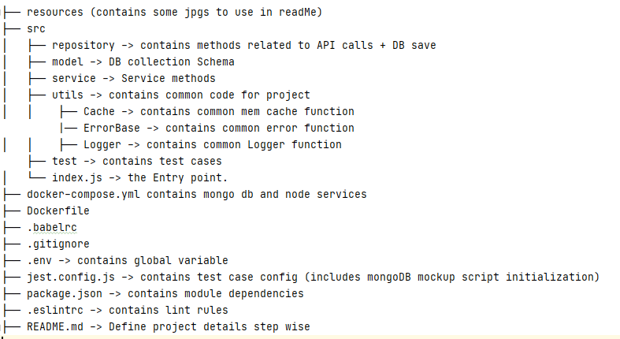
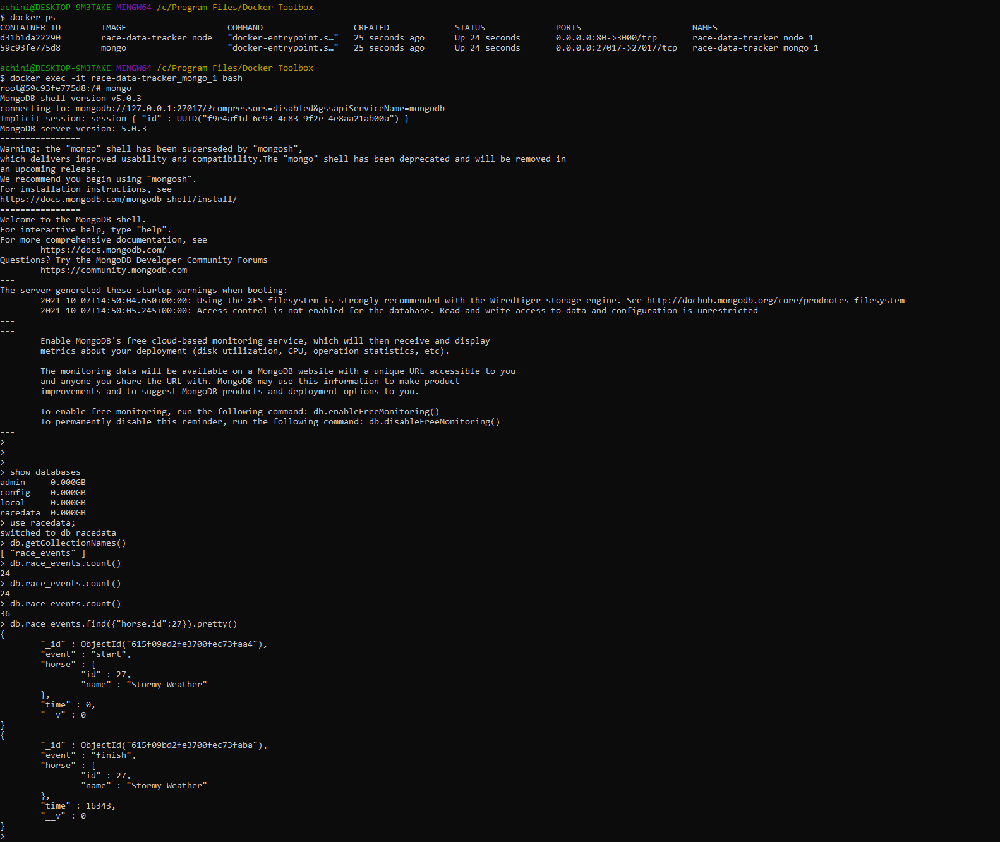
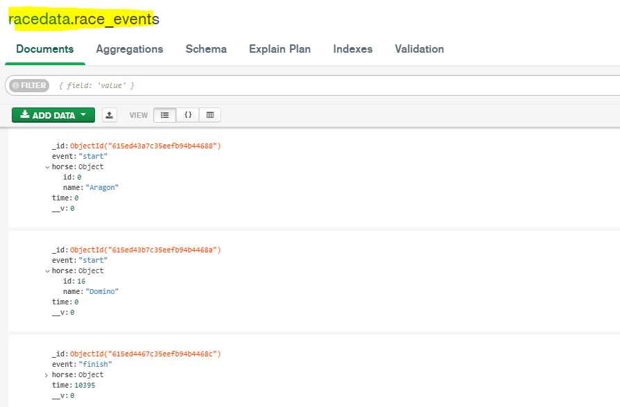

# race-data-tracker
Client Side long Polling to fetch data from 3rd party API

## Prerequisites
- NodeJS (local env is v16.10.0 and docker base img is also same verison) 
- Docker

## Starting Project

### To start the project in docker environment

`docker-compose up --build
`

### To start the project in local environment

- `in .env file change the DATABASE_URL to DATABASE_URL=mongodb://localhost:27017/racedata
`
- `npm install
`
- `npm run execute
`

### To run the unit tests

`npm run test`

## Package Structure

### Additional Libraries added
- axios (Promise based HTTP client)
- mongoose (mongoDB ODM)  
- dotenv (Loads environment variables from .env file)
- memory-cache (imple in-memory cache to store token, so that we can reduce the calls making to auth API)
- winston (logger library)
  
#### dev dependencies
- babel (transpiler)
- eslint (for linting)
- jest (for TDD - unit testing)
- mongodb-memory-server (mongodb mock server for testing) 
   
   

### Design Assumptions

Since we dont have any visibility on the server app, Client side polling is implemented. 
For this kind of scenario where we need to publish and subscripe the events, using websockets/server sent Events (when browser is the client)
would be ideal.

### To verify your application is up and running in docker environment

- `docker ps  // you will see available containers for node and mongo db)`
- `docker exec -it <mongo db container id> bash (you'll go to the shell of mongo container)`
- `mongo (will go to mongo shell)`
- `show databases (to get availabale databases)`
- `use racedata (to use our db)`
- `db.getCollectionNames() (you'll get available collections)`
- `db.race_events.count() (to get the total count of the docs created up to now)`
- `db.race_events.find({"hores.id": 27}).pretty() (will pretty print the documents related to horse with id 27)`

### Example:- 

### To check in local environment
You can install kongoDB Compass and get the overview of your saved data
### Example:-

